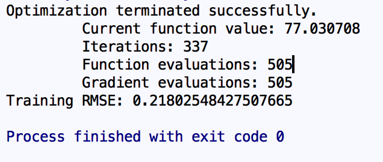
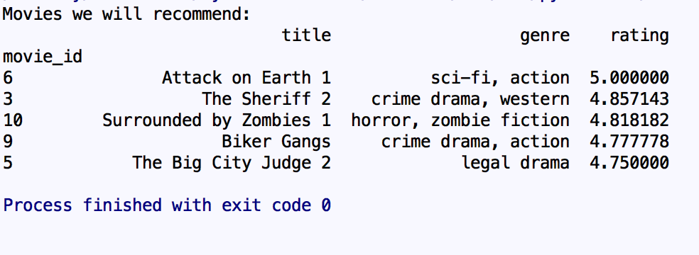
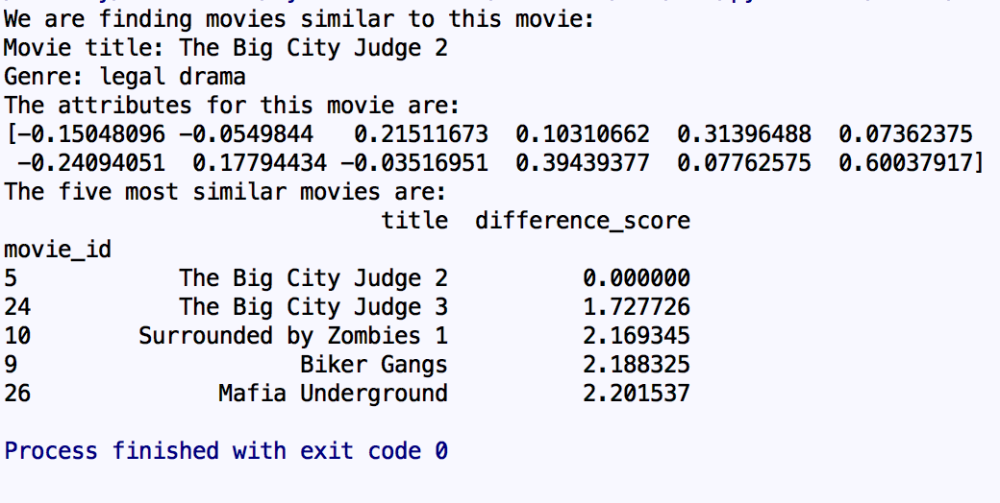

# Recommender

## Recommender using python libraries numpy, pandas and pickle

Imported custom Low-ranked Matrix factorization algorithum
The files are stored in 2 files, trainning and Recommendation
We are only using the movie_rating_data_set_training.csv as the training data.
The data is in the format (user_id, movie_id and rating).
Refered to movies.csv for the movie names
The training result data will be stored in Recommendation/TrainingResults.

# Usage
Run train_recommender_cold_start.py to train the model.
Result:

# Recommender function
cold_start_recommendation.py returns the user the highest 5 ranked movies.
This should be used when there is no data for the new user/training results.
Results:

product_similarity_from_data.py returns the user 5 most similar movies for user.
It is now hardcoded to find movie no.5 for testing.
The most similar movie is the movie itself.
Results:

